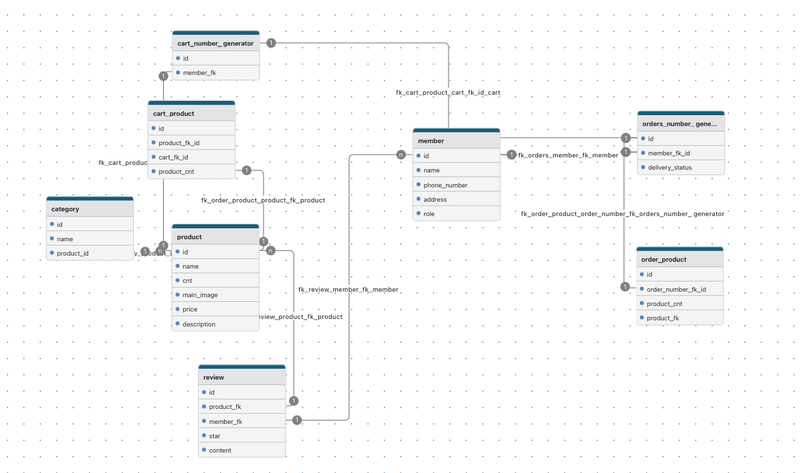

# 🛒 Amazon Backend Clone

이 프로젝트는 아마존의 백엔드 시스템을 클론하여 전자상거래 플랫폼의 핵심 기능을 구현한 것입니다.  
실제 서비스를 모델로 삼아 주문 처리, 상품 관리, 사용자 인증 등 다양한 기능을 포함하고 있습니다.

---

# API 주소 문서
https://lee-backend-developer.github.io/amazon-backend/


## 📌 프로젝트 개요

- **프로젝트명**: Amazon Backend Clone
- **개발자**: [Lee-Backend-Developer](https://github.com/Lee-Backend-Developer)
- **언어**: Java
- **빌드 도구**: Gradle
- **프레임워크**: Spring Boot
- **데이터베이스**: MySQL 또는 PostgreSQL
- **API 설계**: RESTful API

---

## 🗂 ERD (Entity Relationship Diagram)

> 본 프로젝트에서 사용하는 데이터베이스 구조입니다.

 <!-- 저장소 루트에 erd.png 파일을 저장했다고 가정 -->

---

## ✅ 주요 기능

- **상품 관리**: 상품 등록, 수정, 삭제
- **주문 처리**: 장바구니, 주문 생성, 주문 내역 조회
- **사용자 인증**: 회원가입, 로그인, JWT 기반 인증
- **결제 시스템**: 결제 API 연동 (예정)
- **관리자 기능**: 상품 및 주문 관리 대시보드 (예정)

---

## ⚙️ 설치 및 실행 방법

1. 저장소 클론
   ```bash
   git clone https://github.com/Lee-Backend-Developer/amazon-backend.git
   cd amazon-backend
   ./gradlew build
   ./gradlew bootRun
    ```
   
